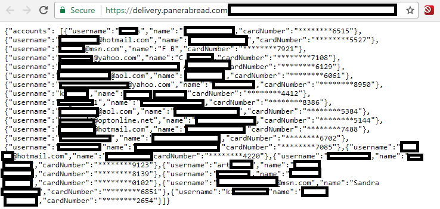
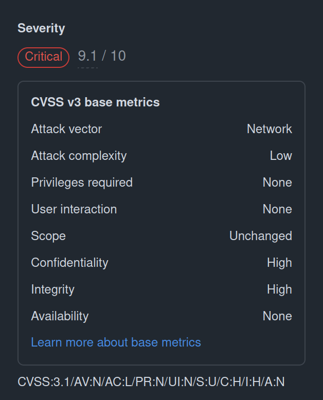
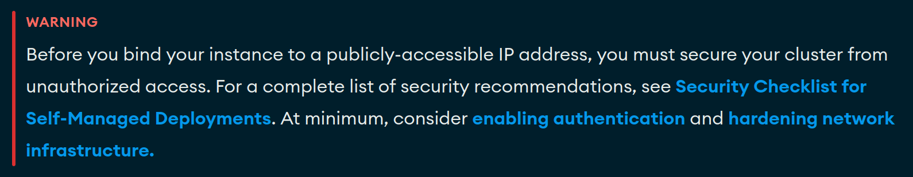
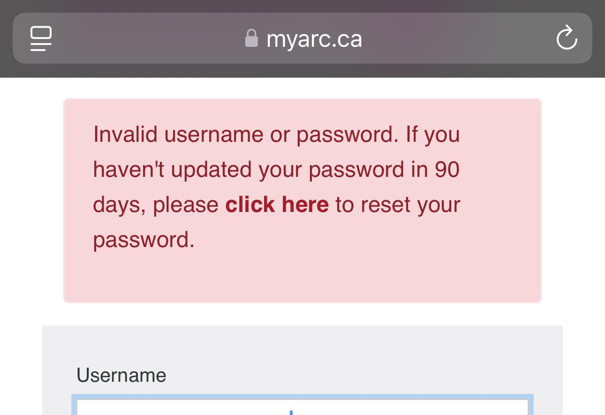

# Praktische Web Security

---

# Was ist Web Security?

- Schutz von (sensiblen) Informationen
- Schutz von Infrastruktur

Angreifer dürfen keinen Zugriff auf Informationen bekommen, die nicht für sie bestimmt sind und die reibungslose
Funktion von Infrastruktur soll gewahrt bleiben.

---

# Warum ist das wichtig?


- SQL Injection über MSSQL um weitere Tools zu installieren
- Millionen von Kreditkartendaten kompromittiert
- 200M$ Verlust für das Unternehmen
- 50 %, später 77 % Verlust am Aktienmarkt
- Trotz PCI DSS Compliance
- 20 Jahre Haft für den Angreifer

---

# Warum ist das wichtig?

<div class="flex flex-col float-end items-end">
    
</div>

- Ungeschützte APIs
- Daten von Millionen Kunden öffentlich abrufbar
- Reaktion auf Report erst nach 8 Monaten (!) und nachdem das Problem öffentlich gemacht wurde



---

# Warum ist das wichtig?

<div class="flex flex-col float-end items-end">
    
    
</div>

- Improper Authorization Vulnerability
- Fehler im Framework mit Auswirkungen auf jede Next.js Seite mit betroffenen Versionen
- Das Setzen vom `x-middleware-subrequest` Header reicht - geringe Hürde

<Footer>
    <a href="https://github.com/vercel/next.js/security/advisories/GHSA-f82v-jwr5-mffw">GitHub Advisory</a>
</Footer>

---

# OWASP Foundation

<div class="flex flex-col float-end items-end">
    
</div>

- OWASP - Open Worldwide Application Security Project ist eine nonprofit foundation
- Autorität beim Thema Web Security
- Resourcen zum Thema Security mit praktischen Beispielen und Empfehlungen

<Footer>
    <a href="https://owasp.org/">OWASP</a>
</Footer>

---

# A01:2021 – Broken Access Control

```kt
@RestController
@RequestMapping("/api/admin")
class AdminController(private val userService: UserService) {

    @GetMapping("/users")
    fun getAllUsers(): List<User> {
        return userService.getAllUsers()
    }
}
```

<br>

<v-click>

- Zugriff verfügbar für jeden, weil Check fehlt
- Zugriff an Checks vorbei durch Aufruf von "geheimen" URLs oder indem Parameter gezielt modifiziert werden
- Überschreiten der Nutzerprivilegien

</v-click>

---

# A01:2021 – Broken Access Control

- Deny by default - Zugriff standardmäßig ablehnen und nur explizit erlauben
    - Standardverhalten von Spring Security
- Zugriffskontrolle möglichst global implementieren damit es automatisch richtig ist
- Tokens nach Logout invalidieren oder kurze Gültigkeiten

<br>

<v-click>

```kt
@Configuration
class SecurityConfig {
    @Bean
    fun apiFilterChain(http: HttpSecurity): SecurityFilterChain = http
        .authorizeHttpRequests { authz ->
            authz.requestMatchers("/api/**").authenticated()
        }
        .oauth2ResourceServer { oauth ->
            oauth.jwt { jwt ->
                jwt.jwtAuthenticationConverter(jwtAuthenticationConverter())
            }
        }
}
```

</v-click>

---

# A02:2021 – Cryptographic Failures

```ts
const response = await fetch("http://example.com/api/data", { headers: { "Authorization": "Bearer xyz" } })
```

<br>

<v-click>

- Datentransfer über Klartext
- Schwache oder veraltete Algorithmen/Verfahren
- Ausgeschaltete Zertifikatsprüfung

</v-click>

<br>

<v-click>

```bash
node --openssl-legacy-provider main.js
```

</v-click>

---

# A02:2021 – Cryptographic Failures

- Datentransfer nur verschlüsselt
- Daten nicht unnötig speichern und so früh wie möglich löschen
- Aktuelle und starke Algorithmen/Verfahren

---

# A03:2021 – Injection

```kt
@Repository
class UserRepository(private val jdbcTemplate: JdbcTemplate) {

    fun findUserByUsername(username: String): User? {
        val sql = "SELECT * FROM users WHERE username = '$username'"
        return jdbcTemplate.queryForObject(sql, UserRowMapper())
    }
}
```

<br>

<v-click>

```sql
SELECT * FROM users WHERE username = 'admin' OR '1' = '1'
```

</v-click>

<br>

<v-click>

- Fehlende Validierung von Nutzereingaben
- Dynamische Anfragen ohne Escaping als Parameter für Interpreter

</v-click>

---

# A03:2021 – Injection

```vue

<script setup lang="ts">
  import { ref } from "@vue/reactivity"

  const userInput = ref('');
</script>

<template>
  <input v-model="userInput" placeholder="Enter text"/>
  Output: <span v-html="userInput"></span>
</template>
```

<br>

---

# A03:2021 – Injection

- Am besten: Sichere APIs verwenden
- Serverseitige Validierung
- Escaping

---

# A03:2021 – Injection

```kt
@Repository
class UserRepository(private val jdbcTemplate: JdbcTemplate) {

    fun findUserByUsername(username: String): User? {
        val sql = "SELECT * FROM users WHERE username = ?"
        return jdbcTemplate.queryForObject(sql, UserRowMapper(), username)
    }
}
```

<br>

```vue

<script setup lang="ts">
  import { ref } from "@vue/reactivity"

  const userInput = ref('');
</script>

<template>
  <input v-model="userInput" placeholder="Enter text"/>
  Output: <span>{{ userInput }}</span>
</template>
```

---

# A05:2021 – Security Misconfiguration

```properties
management.endpoints.web.exposure.include=*
```

<v-click>

Zugriff auf bspw. `/actuator/env`, `/actuator/shutdown`, `/actuator/heapdump`.

</v-click>

<v-click>

- Fehlende oder fehlerhafte Konfiguration
- Standard Konfiguration oder unveränderte Zugangsdaten
- Unnötige Features sind aktiviert oder Security-Features sind deaktiviert

</v-click>

<br>

<v-click>

```kt
@Bean
fun corsConfigurer() = object : WebMvcConfigurer {
        override fun addCorsMappings(registry: CorsRegistry) {
            registry.addMapping("/**")
                .allowedMethods("GET", "POST", "PUT", "DELETE", "OPTIONS")
                .allowedHeaders("*")
                .allowedOrigins("*")
                .exposedHeaders(Headers.AUTHORIZATION_STRING)
        }
    }
```

</v-click>

---

# A05:2021 – Security Misconfiguration

- Automatisierung mit Linting/Testing/CI
- Code Reviews und regelmäßiges Auditing
- Dokumentation lesen und sich mit Technologie auseinandersetzen

<br>



<Footer>
    <a href="https://www.mongodb.com/docs/manual/tutorial/install-mongodb-on-ubuntu/#additional-information">MongoDB Warnung</a>
</Footer>

---

# A06:2021 – Vulnerable and Outdated Components


---

# A06:2021 – Vulnerable and Outdated Components


<Footer>
    <a href="https://npmgraph.js.org/?q=nuxt">Nuxt Dependency Graph</a>
</Footer>

---

# A06:2021 – Vulnerable and Outdated Components

- Anfällige Abhängigkeiten oder Infrastruktur
- Versionen und Komponenten sind nicht genau bekannt oder zu viele um den Überblick zu behalten
- Langsame oder keine Updates
- Keine ausreichenden Tests bei Updates

---

# A06:2021 – Vulnerable and Outdated Components

- Regelmäßige Updates, auch von größeren Komponenten
- Tooling zum automatischen Ermitteln von Abhängigkeiten und Vulnerabilites
- Entfernen von ungenutzten Komponenten

---

# A07:2021 – Identification and Authentication Failures

- Kein Schutz gegen schwache Passwörter
- Keine Möglichkeit zu MFA
- Angreifbare Prozesse zur Passwortwiederherstellung

<br>

<v-click>



</v-click>

---

# A07:2021 – Identification and Authentication Failures

- Passwortrichtlinien umsetzen und erzwingen
  - Mindestlänge 10-12 Zeichen und möglichst ein Mix von Buchstaben, Nummern und Symbolen
- Häufig genutzte Passwörter ablehnen (anhand einer Liste, Datenbank oder API)
- Rate-Limiting und Deaktivierung bei vielen Anmeldeversuchen
- Nicht mit Standard-Passwörtern ausrollen, sondern die Konfiguration erforderlich machen

---

# A08:2021 – Software and Data Integrity Failures 

- Konsum von Daten aus unbekannten oder unsicheren Quellen
- Supply Chain Attacken: Verbreiten von Schadsoftware anstelle des eigentlichen Pakets
- Eingriff in den CI/CD Prozess

---

# A08:2021 – Software and Data Integrity Failures 

- Integritätschecks und digitale Signaturen einsetzen
- Verwendung von vertrauenswürdigen Repositories wie npm oder Maven Central
  - Eigene Repositories als Proxy
- Festsetzen von Softwareversionen um automatische Updates zu vermeiden
- Reviews und Zugriffskontrolle für Code, Konfigurationen und CI/CD
- Tooling zum Finden von Malware (z.B. OWASP Security Check)

---

# A09:2021 – Security Logging and Monitoring Failures 

- Wichtige Events wie (fehlgeschlagene) Logins oder wichtige Transaktionen sollten geloggt werden
- Alerting für schnelle Reaktion
- Historische Aufbewahrung um Analyse zu ermöglichen
- Konkreter Plan um auf Angriffe zu reagieren

---

# A10:2021 – Server-Side Request Forgery (SSRF)

```kt
@RestController
@RequestMapping("/fetch")
class FetchController {

    @GetMapping
    fun fetchUrl(@RequestParam url: String): ResponseEntity<String> {
        val restTemplate = RestTemplate()
        val response = restTemplate.getForEntity(url, String::class.java)
        return ResponseEntity.ok(response.body)
    }
}
```

<br>

<v-click>

- Aufruf von URLs über Parameter
- Zugriff auf interne Infrastuktur und Services

</v-click>

---

# A10:2021 – Server-Side Request Forgery (SSRF)

- Keine dynamischen URLs zulassen
- Whitelist und Validierung, wenn erforderlich

---

<div class="flex flex-col items-center justify-center h-full">
  

  https://app.hackthebox.com/challenges/Spookifier
</div>

---

# Hack The Box Lösung

- Template Injection mit Dateisystemzugriff
- Engine erlaubt es beliebigen Python-Code auszuführen

<br>

<v-click>

```
${open("/flag.txt", "r").read()}
```

</v-click>
