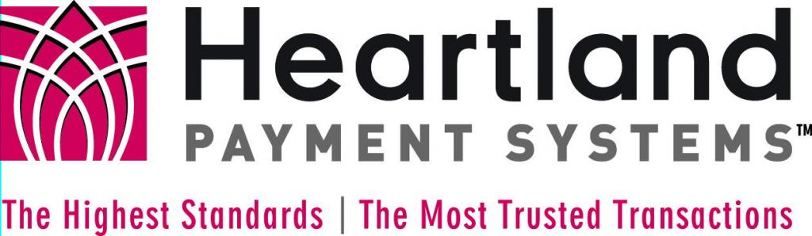

# Praktische Web Security

---

# Was ist Web Security?

- Schutz von (sensiblen) Informationen
- Schutz von Infrastruktur

Angreifer dürfen keinen Zugriff auf Informationen bekommen, die nicht für sie bestimmt sind und die reibungslose
Funktion von Infrastruktur soll gewahrt bleiben.

---

# Warum ist das wichtig?

- SQL Injection über MSSQL um weitere Tools zu installieren
- Millionen von Kreditkartendaten kompromittiert
- 200M$ Verlust für das Unternehmen
- 50 %, später 77 % Verlust am Aktienmarkt
- Trotz PCI DSS Compliance
- 20 Jahre Haft für den Angreifer

---

# Warum ist das wichtig?

    

- Ungeschützte APIs
- Daten von Millionen Kunden öffentlich abrufbar
- Reaktion auf Report erst nach 8 Monaten (!) und nachdem das Problem öffentlich gemacht wurde

---

# Warum ist das wichtig?

    
    

- Improper Authorization Vulnerability
- Fehler im Framework mit Auswirkungen auf jede Next.js Seite mit betroffenen Versionen
- Das Setzen vom `x-middleware-subrequest` Header reicht - geringe Hürde

<Footer>
    <a href="https://github.com/vercel/next.js/security/advisories/GHSA-f82v-jwr5-mffw">GitHub Advisory</a>
</Footer>
